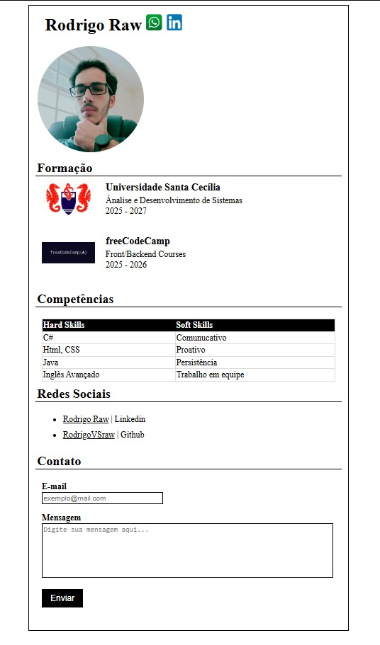

# PROJETO PORTIFÓLIO
Neste projeto fiz um portifólio básico para colocar em prática os aprendizados das minhas aulas

## 📑 PREVIEW

## 📋 Descrição

Usei neste projeto:
- Fotos
- Links
- Imagens clicaveis
- Várias técnicas de CSS, para deixar o formulário bem estruturado

## 🖥 TÉCNOLOGIAS USADAS

- CSS
- HTML
